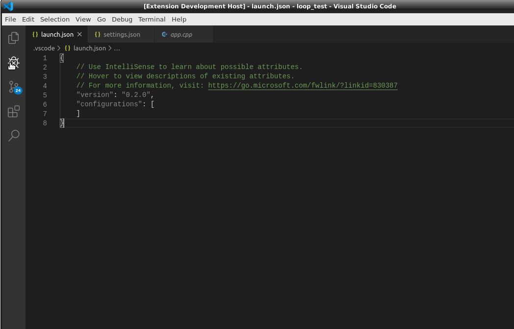
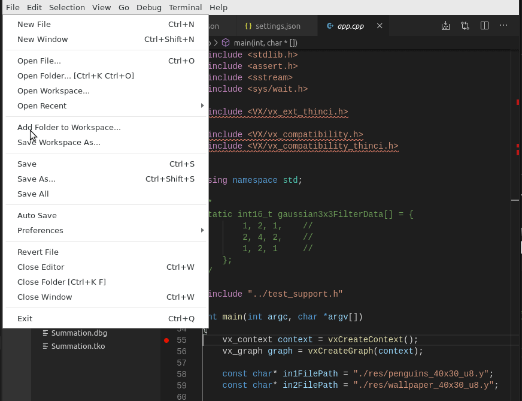
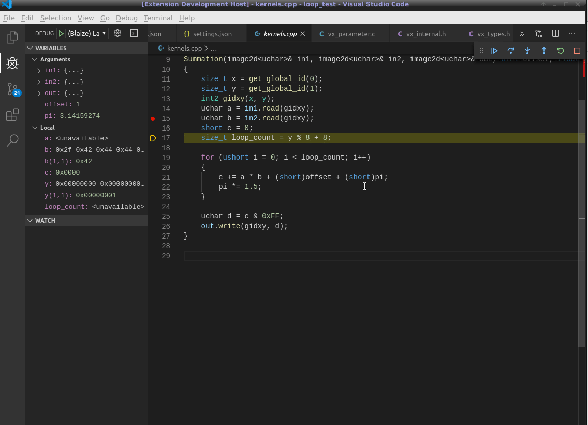

# `Blaize GSP Debug`

This extension enables debug of the Blaize GSP and its host CPU.

# `Notes`

- Remember you may need to configure the startup folder correctly in the launch task
- You can configure the environment passed to the Debug Adapter in Settings.blaize.debug.environment
- F5 starts debugging
- When debugging:
  - F5 - To continue this thread's execution
  - Alt-F5 To continue all of the current process's threads execution
  - F9 Toggle breakpoint on current line
  - F10 - Step over
  - F11 - Step in
  - Shift F11 - Step out
  - Ctrl-Shift-F5 - Restart

# `Configuring a Debug Session`

In the debug view select Add Configuration. This will pop up a list selection box, from that select **Blaize GSP Debugger: Launch**

This will open launch.json and show a configuration like the below:

The key fields to modify are:

* `name` : The name that will appear in the debug configurations dropdown.
* `program`: The path to the program to be debugged.
* `startupFolder`: The path that will be current when the program starts.
* `arguments`: A list of command line arguments to pass to the program.
* `terminal`: Selecting integrated will send any output to the terminal view, selecting console will send output to the Debug Console view and external will start an external terminal view.

# `Settings`

There are a number of settings that configure the debugger, these are accessed via File/Preferences/Settings or alternately by pressing **Ctrl** + **,**. In the search box type blaize to show only those settings relative to the debugger.

`Blaize.Debug.Environment`: A collection of key value pairs to be injected into the debug process's environment.

`Blaize.Debug.Number_format`: The fomat to use when displaying numbers in the variables view, possible values are:

* `auto`: Simply use whatever the underlying debugger (lldb) uses by default.
* `binary`: Display all variables as binary.
* `decimal`: Display all variables as decimal.
* `hex`: Display all variables as hex - lower case (e.g. 0xabcdef01).
* `HEX`: Display all variables as hex - upper case (e.g. 0XABCDEF01).

the default setting is auto

`Blaize.Debug.Terminal`: The type of terminal to connect to the debugged process. Options are:

* `integrated`: Input and output will be via the Terminal View.
* `console`: Input and output will be via the Debug Console view.
* `external`: The debugger will create an external terminal for input and output. Be aware that the debugger will not automatically close this terminal when the process exits and it will not be reused.

#`Threads View`

The threads view

